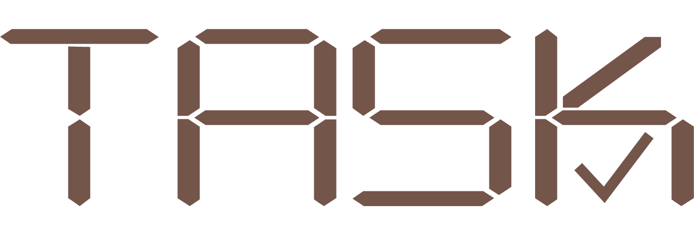
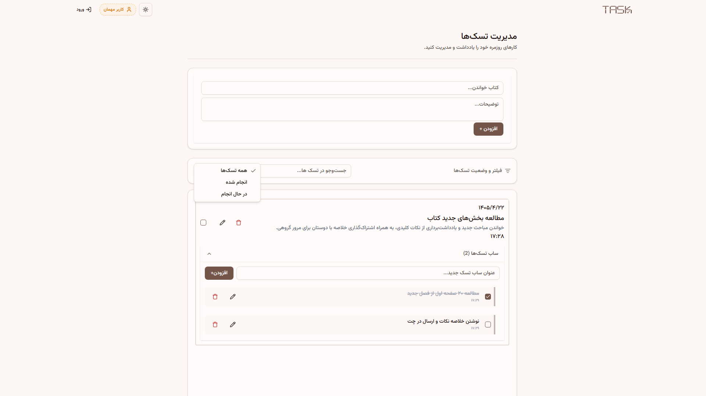
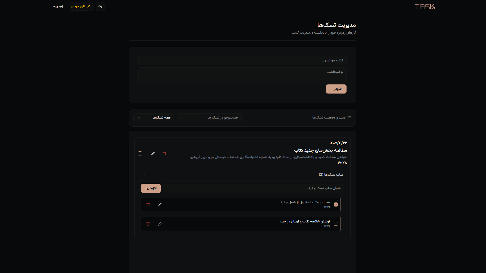

<p align="center">
  
</p>

<p align="center">
  A modern, enterprise-grade task management system featuring anonymous onboarding, subtasks management, and real-time optimistic updates.
</p>

<h2 align="center">
  <strong>🔗 Live Demo:</strong> <a href="https://amp-task.ir" target="_blank"><strong>amp-task.ir</strong></a>
</h2>

[](https://react.js.org/) [](https://redux-toolkit.js.org/) [](https://redux-toolkit.js.org/rtk-query/overview) [](https://tailwindcss.com/) [](https://ui.shadcn.com/) [](https://axios-http.com/) [](https://reactrouter.com/)

---

## 📸 Screenshots

<p align="center">
  
</p>

<p align="center">
  
</p>

---

## ✨ Features

- 🎨 **Custom Branding** — Unique, hand-crafted logo and identity.
- 🌗 **Dark / Light Mode** — Seamless, layout-wide theme toggling.
- 👤 **Guest Mode (Ghost ID)** — Start using the app instantly without creating an account. Add and manage tasks as a guest; once you sign up or log in, local tasks automatically synchronize with the cloud database.
- ⚡ **Optimistic UI Updates** — Instant feedback on high-frequency mutations (adding/toggling tasks) ensuring a zero-latency UX by skipping network round-trips.
- 🧩 **Subtasks Architecture** — Break complex tasks down into smaller, granular, and manageable subtasks.
- ✏️ **Full CRUD Capabilities** — Edit and manage tasks and subtasks smoothly at any time.
- 📝 **Detailed Task Descriptions** — Attach contextual descriptions and extended metadata to each task.
- 🔍 **Real-time Search** — Instantly filter and find tasks using keyword matching.
- 🗂️ **Status Filtering** — Dynamically toggle views based on task completion state (Completed / In Progress).
- 🔐 **Two-Factor Authentication (2FA)** — Secure, email-based OTP verification layer during user authentication.
- 📧 **Secure Account Management** — Safely update account configurations including a secure email modification flow.
- 📱 **Fully Responsive Layout** — A unified, pixel-perfect experience tailored across mobile, tablet, and desktop viewports.

---

## 🛠️ Tech Stack

| Category | Technology |
|---|---|
| Frontend Library | React |
| State Management | Redux Toolkit |
| Data Fetching & Caching | RTK Query |
| UI Components | shadcn/ui |
| Styling | Tailwind CSS |
| HTTP Client | Axios |
| Client Routing | React Router |

---

## 🏗️ Architecture

The project implements a highly scalable **Feature-Based Folder Structure**, decoupling app-level setups, route configurations, and reusable shared logic from specific business domains.

```text
src/
├── app/               # App-level configurations, store, hooks & base queries
│   ├── slices/        # UI-specific global state (modal, theme)
│   ├── baseQuery.ts
│   └── store.ts
├── features/          # Domain-driven features (core business logic)
│   ├── auth/          # Authentication & ghost ID synchronization
│   ├── profile/       # Profile management
│   └── tasks/         # Subtasks, optimistic caching & query filters
├── pages/             # Routing view components
│   ├── LoginPage.tsx
│   ├── ProfilePage.tsx
│   └── TaskPage.tsx
│   └── VerifyPage.tsx
├── router/            # Route declarations & router mapping
├── shared/            # Globally shared codebase assets & components
│   ├── components/
│   ├── ui/            # shadcn components
│   └── types/
└── App.tsx            # Main application entry component